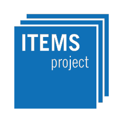

JSXGraph
========

JavaScript library for interactive math visualizations in the web browser.

About
-----

*JSXGraph* is a cross-browser library for interactive geometry, function plotting,
charting, and data visualization in a web browser. It is implemented completely
in JavaScript, does not rely on any other library, and uses SVG, canvas, or even the venerable VML.
*JSXGraph* is easy to embed and has a small footprint: approx. 160 KByte if
embedded in a web page. No plug-ins are required! Special care has been taken
to optimize the performance.

*JSXGraph* supports multi-touch events and runs on all major browsers, even on very old IEs.

*JSXGraph* is developed at the
Lehrstuhl für Mathematik und ihre Didaktik
University of Bayreuth, Germany

Website
-------

- Project web site: https://jsxgraph.org/
- Project wiki with hundreds of examples: https://jsxgraph.org/wiki/
- GitHub project site: https://github.com/jsxgraph/jsxgraph
- Mailing List/Google Group: https://groups.google.com/group/jsxgraph
- JSXGraph questions at https://stackoverflow.com/search?tab=newest&q=jsxgraph
- jsFiddle template: https://jsfiddle.net/8kep9syd/
- YouTube channel: https://www.youtube.com/channel/UCANBFoVoOyW2eNyTvx-VZdQ
- Moodle filter: https://github.com/jsxgraph/moodle-filter_jsxgraph
- (outdated: SourceForge project site: https://sf.net/projects/jsxgraph)
- CDNs: Embed JSXGraph via

```html
<script type="text/javascript" charset="UTF-8"
 src="https://cdn.jsdelivr.net/npm/jsxgraph/distrib/jsxgraphcore.js"></script>
<link rel="stylesheet"
 type="text/css" href="https://cdn.jsdelivr.net/npm/jsxgraph/distrib/jsxgraph.css" />
 ```

or

```html
<script type="text/javascript" charset="UTF-8"
 src="//cdnjs.cloudflare.com/ajax/libs/jsxgraph/1.4.6/jsxgraphcore.js"></script>
<link rel="stylesheet"
 type="text/css" href="//cdnjs.cloudflare.com/ajax/libs/jsxgraph/1.4.6/jsxgraph.css" />
```

Please report bugs to our issue tracking system found at
https://github.com/jsxgraph/jsxgraph/issues

Usage
-----

Include

* `jsxgraphcore.js` and
* `jsxgraph.css` and,
* if required, one or more file readers

from a CDN or a local version in your HTML file.

**HTML template:**

```html
<!doctype html>
<html lang="en">
  <head>
    <meta charset="UTF-8">
    <title>JSXGraph template</title>
    <meta content="text/html; charset=utf-8" http-equiv="Content-Type">
    <link href="https://cdn.jsdelivr.net/npm/jsxgraph/distrib/jsxgraph.css" rel="stylesheet" type="text/css" />
    <script src="https://cdn.jsdelivr.net/npm/jsxgraph/distrib/jsxgraphcore.js" charset="UTF-8"></script>

    <!-- The next line is optional: MathJax -->
    <script src="https://cdn.jsdelivr.net/npm/mathjax@3/es5/tex-chtml.js" id="MathJax-script" async></script>
  </head>
  <body>

  <div id="jxgbox" class="jxgbox" style="max-width:800px; aspect-ratio: 1/1;"></div>

  <script>
    var board = JXG.JSXGraph.initBoard('jxgbox', {boundingbox: [-8, 8, 8, -8]});
    var p = board.create('point', [1, 3], {name: 'point'});
  </script>

  </body>
</html>
```

For developing content, it is recommended to include `jsxgraphsrc.js` (`jsxgraphcore.js` is the minified version of `jsxgraphsrc.js`).
For further usage instructions please consult our [wiki](https://jsxgraph.org/wiki/)
especially our [tutorials](https://jsxgraph.org/wiki/index.php/Documentation)
or [the API reference docs](https://jsxgraph.org/docs/).

Build and develop JSXGraph
--------------

1) Clone this repository or download the zip file.
2) To build and develop *JSXGraph* you need [node.js](https://nodejs.org/) v0.6+. First, install all
dependencies required to build JSXGraph using npm in the JSXGraph root directory: `$ npm install`.
This will create a new subdirectory ```node_modules``` in the JSXGraph root directory which holds
all tools and libraries required to build ```jsxgraphcore.js```.
3) To build JSXGraph run `$ npm run buildCore`. This will output an non-minified version `jsxgraphsrc.js`
and the minified version `jsxgraphcore.js` into the folder `distrib`.
4) Develop JSXGraph:
  - Edit the source files in the folder `src`
  - Write unit tests in folder `test`
  - Run `$ npm run eslint` and `$ npm run test` to check for errors
  - Run `$ npm run check-format` to check the formatting of the source code
  - Submit a pull request


License
-------

JSXGraph is free software dual licensed under the GNU LGPL or MIT License.

You can redistribute it and/or modify it under the terms of the

- GNU Lesser General Public License as published by
    the Free Software Foundation, either version 3 of the License, or
    (at your option) any later version
  
or

- MIT License: https://github.com/jsxgraph/jsxgraph/blob/master/LICENSE.MIT

JSXGraph is distributed in the hope that it will be useful,
but WITHOUT ANY WARRANTY; without even the implied warranty of
MERCHANTABILITY or FITNESS FOR A PARTICULAR PURPOSE.  See the
GNU Lesser General Public License for more details.

You should have received a copy of the GNU Lesser General Public License and
the MIT License along with JSXGraph. If not, see <https://www.gnu.org/licenses/>
and <https://opensource.org/licenses/MIT/>.

[](https://itemspro.eu)
[](https://ec.europa.eu/programmes/erasmus-plus/)
