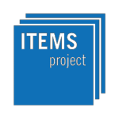

JSXGraph
========

JavaScript library for interactive math visualizations in the web browser.

About
-----

*JSXGraph* is a cross-browser library for interactive geometry, function plotting,
charting, and data visualization in a web browser. It is implemented completely
in JavaScript, does not rely on any other library, and uses SVG, canvas, or even the venerable VML.
*JSXGraph* is easy to embed and has a small footprint: approx. 160 KByte if
embedded in a web page. No plug-ins are required! Special care has been taken
to optimize the performance.

*JSXGraph* supports multi-touch events and runs on all major browsers, even on very old IEs.

*JSXGraph* is developed at the
Lehrstuhl für Mathematik und ihre Didaktik
University of Bayreuth, Germany

Website
-------

* Project web site: https://jsxgraph.org/
* Project wiki with hundreds of examples: https://jsxgraph.org/wiki/
* GitHub project site: https://github.com/jsxgraph/jsxgraph
* Mailing List/Google Group: https://groups.google.com/group/jsxgraph
* JSXGraph questions at https://stackoverflow.com/search?tab=newest&q=jsxgraph
* jsFiddle template: https://jsfiddle.net/vcL7aepo/1/
* Moodle filter: https://github.com/jsxgraph/moodle-filter_jsxgraph

Please report bugs to our issue tracking system found at
https://github.com/jsxgraph/jsxgraph/issues

Usage
-----

Include `jsxgraphcore.js` and `jsxgraph.css` and, if required, one or more file readers in your HTML
file. For further usage instructions please consult our [wiki](https://jsxgraph.org/wiki/)
especially our [tutorials](https://jsxgraph.org/wiki/index.php/Documentation)
or [the API reference docs](https://jsxgraph.org/docs/).

License
-------

    Copyright 2008-2020
        Matthias Ehmann,
        Michael Gerhaeuser,
        Carsten Miller,
        Emmanuel Ostenne,
        Bianca Valentin,
        Heiko Vogel,
        Alfred Wassermann,
        Peter Wilfahrt

JSXGraph is free software dual licensed under the GNU LGPL or MIT License.

You can redistribute it and/or modify it under the terms of the

  * GNU Lesser General Public License as published by
    the Free Software Foundation, either version 3 of the License, or
    (at your option) any later version
  OR
  * MIT License: https://github.com/jsxgraph/jsxgraph/blob/master/LICENSE.MIT

JSXGraph is distributed in the hope that it will be useful,
but WITHOUT ANY WARRANTY; without even the implied warranty of
MERCHANTABILITY or FITNESS FOR A PARTICULAR PURPOSE.  See the
GNU Lesser General Public License for more details.

You should have received a copy of the GNU Lesser General Public License and
the MIT License along with JSXGraph. If not, see <https://www.gnu.org/licenses/>
and <https://opensource.org/licenses/MIT/>.

